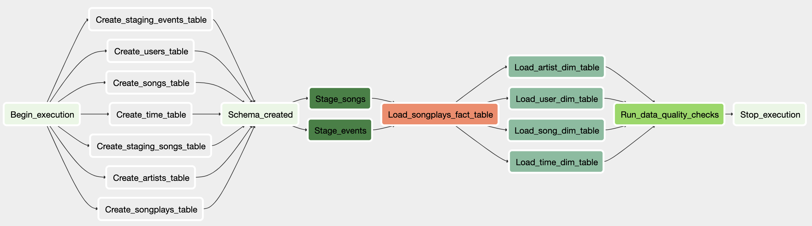

# Data Pipelines with Airflow

Sparkify, a music streaming startup, would like to automate and monitor their data warehouse ETL pipelines via using Apache Airflow. The source datasets, song_data and log_data, are stored in S3 with JSON format and need to be extracted, transformed, and loaded into Redshift(data warehouse). In this project, I will write python scripts to automate and monitor ETL process through Airflow.


### Datasets
There are two datasets that reside in public S3 buckets:
- Song data: ```s3://udacity-dend/song_data```
- Log data: ```s3://udacity-dend/log_data```

I created my own S3 buckets and uploaded song_data and log_data onto it, so the s3 bucket path I'm using here are:
- Song data: ```s3://airflow-udacity/song_data```
- Log data: ```s3://airflow-udacity/log_data```

### Schema
A star-schema Redshift database is created and optimized for queries on song play analysis, and this includes the following tables:

#### Fact Table
**songplays** - records in log data associated with song plays i.e. records with page ```NextSong```
- *songplay_id, start_time, user_id, level, song_id, artist_id, session_id, location, user_agent*

#### Dimension Tables
**users** - users in the app
- *user_id, first_name, last_name, gender, level*

**songs** - songs in music database
- *song_id, title, artist_id, year, duration*

**artists** - artists in music database
- *artist_id, name, location, lattitude, longitude*

**time** - timestamps of records in songplays broken down into specific units
- *start_time, hour, day, week, month, year, weekday*

### Project Structure
```
airflow-------------------------------- # AIRFLOW MAIN FOLDER
├── dags
│   └── s3_to_redshift_dag.py---------- # PYTHON SCRIPT FOR DAG DEFINITION
└── plugins
    ├── helpers
    │	└── sql_queries.py------------- # SQL QUERIES FOR CREATING AND INSERTING DATA
    └── operators
		├── data_quality.py------------ # DataQualityOperator
		├── load_dimension.py---------- # LoadFactOperator
		├── load_fact.py--------------- # LoadDimensionOperator
		└── stage_redshift.py---------- # StageToRedshiftOperator
```

### Airflow
Airflow uses a DAG - Directed Acyclic Graph - which is a collection of tasks that people want to run, so that all the relationships and dependencies can be reflected through Airflow UI.

