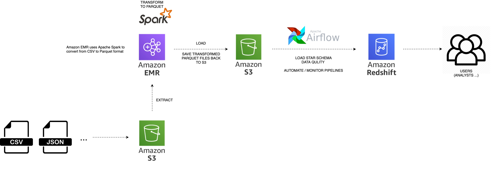

# Udacity Data Engineering Capstone Project

## Overview

In this project, I will apply what I've learned from the previous lessons to:

1. Design the conceptural star-schema database.
2. Build ETL pipelines in python script.
3. Use AWS Cloud Services (S3, Redshift, EMR) and Spark for building data model.
4. Use Airflow to automate and monitor pipelines.

The goal of this project is to get myself familiar with the whole data engineering steps from the beginning database schema design to the data model building part which will take advantage of cloud computing. First, a data warehouse is built by using 4 datasets listed in the following part. Then, model the data in the cloud.

## Datasets

I will use the provided 4 datasets which are (1)main immigration data to the United States (2.1)supplementary dataset about airport codes (2.2) U.S. city demographics data (2.3)temperature data.

## Project Steps

### Step 1: Scope the Project and Gather Data

Since the scope of the project will be highly dependent on the data, these two things happen simultaneously. In this step, you’ll:

* Identify and gather the data you'll be using for your project (at least two sources and more than 1 million rows). See Project Resources for ideas of what data you can use.
* Explain what end use cases you'd like to prepare the data for (e.g., analytics table, app back-end, source-of-truth database, etc.)

### Step 2: Explore and Assess the Data

* Explore the data to identify data quality issues, like missing values, duplicate data, etc.
* Document steps necessary to clean the data

### Step 3: Define the Data Model

* Map out the conceptual data model and explain why you chose that model
* List the steps necessary to pipeline the data into the chosen data model

### Step 4: Run ETL to Model the Data

* Create the data pipelines and the data model
* Include a data dictionary
* Run data quality checks to ensure the pipeline ran as expected
    * Integrity constraints on the relational database (e.g., unique key, data type, etc.)
    * Unit tests for the scripts to ensure they are doing the right thing
    * Source/count checks to ensure completeness